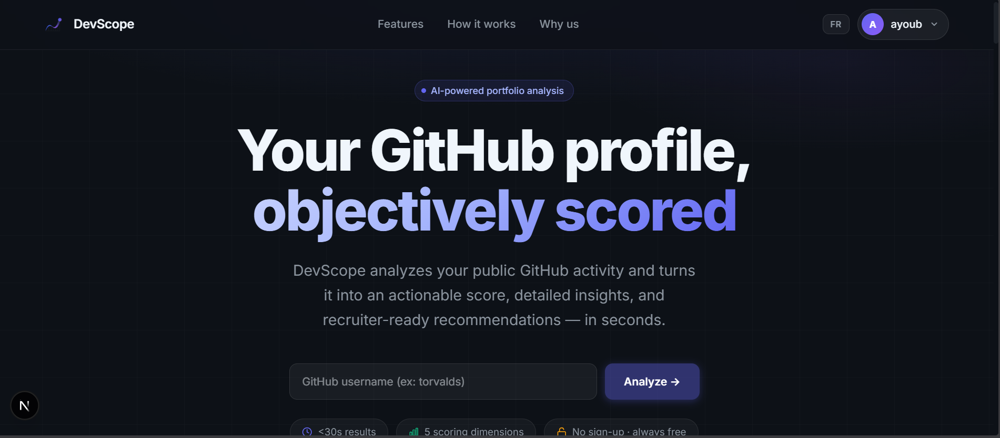
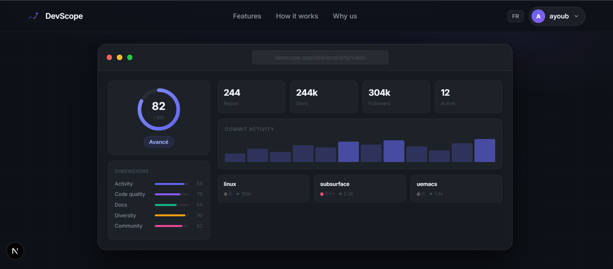
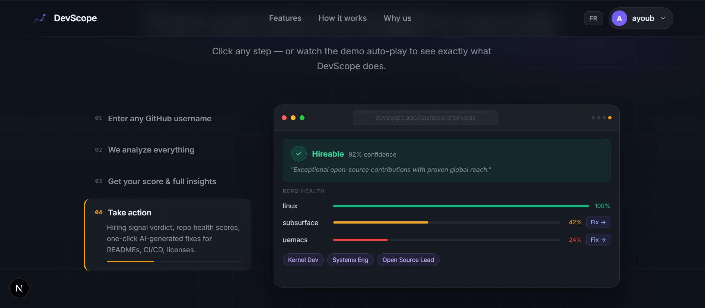
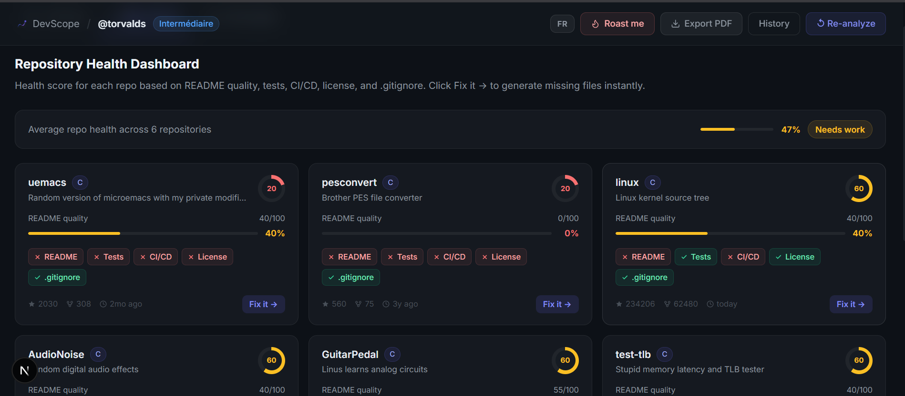
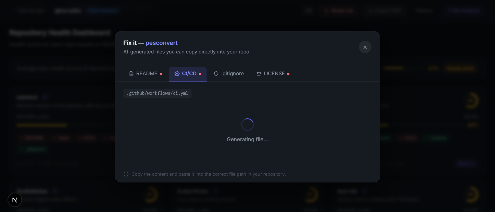
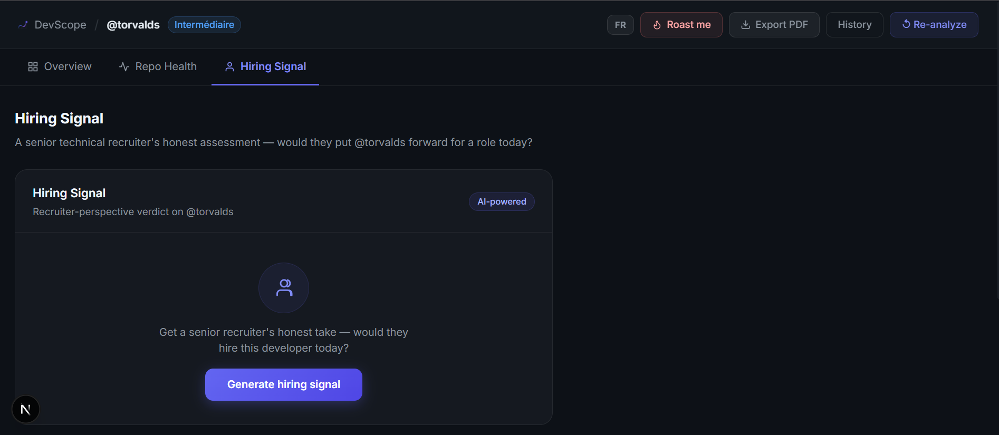
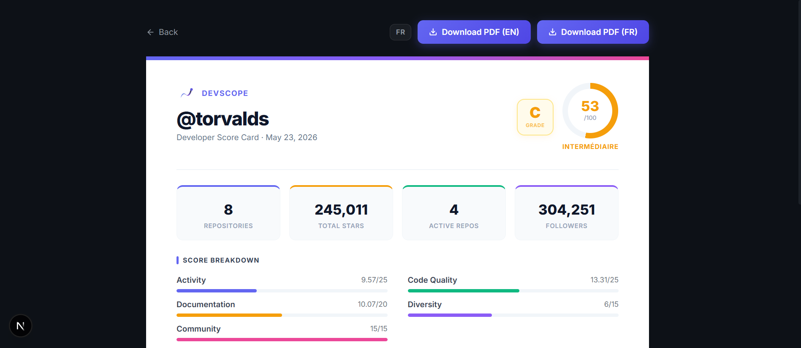

# DevScope

*Your GitHub profile, objectively scored.*


---

DevScope fetches any public GitHub profile and runs it through a five-dimension scoring engine — Activity, Code Quality, Documentation, Language Diversity, and Community — producing a score out of 100 with a detailed breakdown. Beyond the number, it generates an AI narrative review, a per-repo health report, a recruiter-style hiring signal, and one-click AI-generated fixes for the issues that actually drag scores down: missing READMEs, no CI pipeline, no license.

No account needed to analyze any profile. Results in under 15 seconds.

---

## Screenshots

**Landing page**



**Profile overview — score, dimensions, commit activity, top repos**



**How it works — walkthrough section**



**Repository Health Dashboard**



**Fix it — AI-generated files, copy ready**



**Hiring Signal**



**PDF Scorecard**



---

## Demo

[https://github.com/user-attachments/assets/d6123cc1-7681-43e9-86dd-a75911493210](https://github.com/user-attachments/assets/b432778d-c180-4d35-963d-5f42c7bc728d)


## Features

**Profile scoring** — A global score out of 100 broken down across five weighted dimensions. Each dimension is computed independently so you can see exactly where points are being lost, not just the final number.

| Dimension | Weight | What it measures |
|---|---|---|
| Activity | 25 pts | Commit frequency, recency, active repo count in the last 90 days |
| Code Quality | 25 pts | CI/CD presence, test files, README quality per repo |
| Documentation | 20 pts | README completeness, repo descriptions, bio |
| Diversity | 15 pts | Language spread and breadth across repositories |
| Community | 15 pts | Stars, forks, followers, social signals |

**Repository Health Dashboard** — Every repository scored individually with health badges for README quality, Tests, CI/CD, and License. The average across all repos is shown at the top so you can see your weakest area at a glance.

**Fix it** — One button per repo. Click it and get a modal with four AI-generated, copy-ready files: a complete `README.md` with shields.io badges and real code examples; a GitHub Actions CI workflow tuned to the repo's language with dependency caching; a `.gitignore` organized by category; and an MIT `LICENSE`. Everything is generated in context — the AI receives the repo name, primary language, description, topics, star count, and whether tests exist.

**Hiring Signal** — Simulates a senior technical recruiter's assessment of the profile. Returns a verdict (Hireable / Strong Maybe / Not Yet), a confidence percentage, specific strengths, concerns, and best-fit roles.

**Roast me** — The AI reviews the profile and delivers a direct, unsweetened critique of what's holding it back. More useful than it sounds.

**PDF Scorecard** — Exports a clean, printable developer scorecard with the score breakdown, key stats, grade (A+ through D), and AI review. Available in both English and French.

**Bilingual** — The full UI, all AI-generated content, and PDF exports support English and French. Language toggle is available on every page.

**Analysis history** — Previous analyses are cached. Click History on any dashboard to see how a profile has changed over time, then Re-analyze to get a fresh read.

---

## Tech Stack

**Frontend**

| Package | Version | Purpose |
|---|---|---|
| Next.js | 16.2.6 | App Router, SSR, routing |
| React | 19.2.4 | UI framework |
| TypeScript | 5 | Type safety |
| NextAuth | 4.24 | Authentication (GitHub OAuth + credentials) |
| Prisma | 5.22 | Auth database ORM |
| Recharts | 3.8 | Commit activity chart |
| html2canvas + jsPDF | 1.4 / 4.2 | Client-side PDF generation |
| Tailwind CSS | 4 | Utility styling |

**Backend**

| Package | Version | Purpose |
|---|---|---|
| FastAPI | 0.115.5 | REST API framework |
| Python | 3.12 | Runtime |
| uvicorn | 0.32 | ASGI server |
| httpx | 0.28 | Async HTTP client (GitHub API + OpenRouter) |
| aiosqlite | 0.20 | Async SQLite for analysis cache |
| pydantic | 2.10 | Request/response validation |

**AI** — OpenRouter API with model fallback chain: DeepSeek V4 Flash → GPT-OSS 20B → Gemma 4 26B → Qwen3 Coder. All free-tier models; swap to a paid model in `ai_service.py` for higher quality.

---

## Project Structure

```
devscope/
├── backend/
│   ├── app/
│   │   ├── core/               # Settings and config
│   │   ├── database/           # SQLite connection and queries
│   │   ├── models/             # Pydantic request/response models
│   │   └── services/
│   │       ├── ai_service.py       # AI review, roast, hiring signal, fix-it generation
│   │       ├── github_service.py   # GitHub REST API client
│   │       ├── scoring_service.py  # Scoring engine (5 dimensions)
│   │       └── similar_service.py  # AI-powered similar profile finder
│   ├── tests/
│   │   └── test_scoring.py
│   └── requirements.txt
│
└── frontend/
    ├── app/
    │   ├── page.tsx                    # Landing page
    │   ├── dashboard/[username]/       # Main analysis dashboard
    │   ├── scorecard/[username]/       # Printable PDF scorecard
    │   └── api/                        # NextAuth + user API routes
    ├── components/
    │   └── dashboard/                  # All dashboard UI components
    ├── lib/
    │   ├── api.ts                      # Backend API client
    │   ├── auth.ts                     # NextAuth configuration
    │   ├── i18n.tsx                    # EN/FR translation dictionaries
    │   └── types.ts                    # Shared TypeScript interfaces
    └── prisma/
        ├── schema.prisma
        └── migrations/
```

---

## Getting Started

##Live Link to try 

**[→ Devscope](https://developer-portfolio-analytics-platf.vercel.app)**


### Prerequisites

- Node.js 20 or later
- Python 3.12 or later
- A GitHub personal access token (optional but strongly recommended — raises the API rate limit from 60 to 5,000 requests/hour)
- An OpenRouter API key — free tier at [openrouter.ai](https://openrouter.ai)

### 1. Clone

```bash
git clone https://github.com/your-username/devscope.git
cd devscope
```

### 2. Backend

```bash
cd backend

python -m venv .venv
source .venv/bin/activate        # Windows: .venv\Scripts\activate

pip install -r requirements.txt
```

Create `backend/.env`:

```env
OPENROUTER_API_KEY=sk-or-...
GITHUB_TOKEN=ghp_...
```

Start the API server:

```bash
uvicorn app.main:app --reload --port 8001
```

The API runs at `http://localhost:8001`. Interactive Swagger docs at `http://localhost:8001/docs`.

### 3. Frontend

```bash
cd frontend
npm install
```

Create `frontend/.env.local`:

```env
NEXTAUTH_URL=http://localhost:3000
NEXTAUTH_SECRET=generate-with-openssl-rand-base64-32

# GitHub OAuth — create an app at github.com/settings/developers
GITHUB_ID=your_oauth_app_client_id
GITHUB_SECRET=your_oauth_app_client_secret

NEXT_PUBLIC_API_URL=http://localhost:8001
DATABASE_URL=file:./prisma/devscope-auth.db
```

Apply database migrations:

```bash
npx prisma migrate deploy
```

Start the dev server:

```bash
npm run dev
```

Open [http://localhost:3000](http://localhost:3000).

---

## Environment Variables

### `backend/.env`

| Variable | Required | Description |
|---|---|---|
| `OPENROUTER_API_KEY` | Yes | All AI features depend on this |
| `GITHUB_TOKEN` | Recommended | Personal access token for higher API rate limits |

### `frontend/.env.local`

| Variable | Required | Description |
|---|---|---|
| `NEXTAUTH_URL` | Yes | Full base URL of the frontend |
| `NEXTAUTH_SECRET` | Yes | Session signing secret |
| `GITHUB_ID` | For GitHub login | OAuth App client ID |
| `GITHUB_SECRET` | For GitHub login | OAuth App client secret |
| `NEXT_PUBLIC_API_URL` | Yes | Backend base URL |
| `DATABASE_URL` | Yes | Prisma SQLite path for the auth database |

---

## Running Tests

```bash
cd backend
pytest tests/ -v
```

The test suite covers the scoring engine. Frontend type checking runs through `npm run build` and linting through `npm run lint`.

---

## API Reference

Full interactive documentation is available at `http://localhost:8001/docs` when the backend is running.

| Method | Endpoint | Description |
|---|---|---|
| `POST` | `/api/v1/analyze` | Analyze a GitHub profile |
| `GET` | `/api/v1/analysis/{username}` | Retrieve cached analysis |
| `GET` | `/api/v1/history/{username}` | Analysis history |
| `POST` | `/api/v1/roast/{username}` | Generate AI roast |
| `POST` | `/api/v1/hiring-signal/{username}` | Generate hiring signal |
| `POST` | `/api/v1/generate-file/{username}/{repo}` | Generate README / CI / .gitignore / LICENSE |
| `POST` | `/api/v1/similar/{username}` | Find similar GitHub profiles |

---

## Adding the Screenshots

Place the screenshot files in `docs/screenshots/` with these exact names so the README images resolve correctly:

```
docs/screenshots/
├── landing.png              # Screenshot 220938
├── dashboard-overview.png   # Screenshot 220948
├── how-it-works.png         # Screenshot 221007
├── repo-health.png          # Screenshot 221057
├── fix-it-modal.png         # Screenshot 221108
├── hiring-signal.png        # Screenshot 221118
└── scorecard-pdf.png        # Screenshot 221128
```

For the demo video: open any GitHub issue in this repo, drag `Devscope.mp4` into the comment box, wait for the upload, copy the URL it generates, and paste it into the Demo section above.

---

## Contributing

Open an issue before starting on anything significant — quick alignment before you invest time in a direction that might not fit. For small fixes and typos, a PR is fine directly. All AI model configuration lives in `backend/app/services/ai_service.py` and is straightforward to swap out.

---

## License

MIT © 2026 Ayoub Zarkouni
